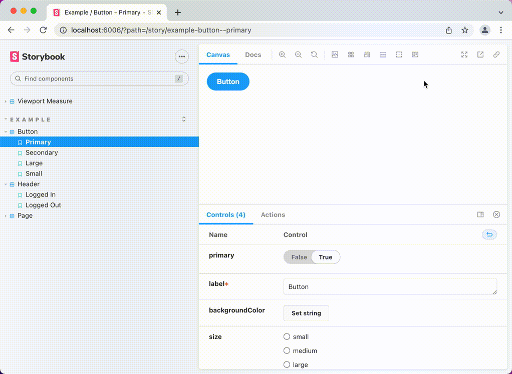

# storybook-addon-measure-viewport

The Measure Viewport addon displays the height and width of the current preview's viewport. Useful for fine-tuning responsive breakpoints.



## Installation

1. Install the addon as a devDependency.

```sh
// Install with NPM
npm install -D storybook-addon-measure-viewport

// Install with Yarn
yarn add -D storybook-addon-measure-viewport
```

2. Add `storybook-addon-measure-viewport` to the `addons` array in [`.storybook/main.js`](https://storybook.js.org/docs/react/configure/overview#configure-your-storybook-project).

```js
// storybook/main.js

module.exports = {
  addons: [
    "addon-a",
    "addon-b",
    "storybook-addon-measure-viewport", // Heads up! Order matters.
    "addon-c",
  ],
};
```

_The order of the addon array determines where the Measure Viewport button shows up in the toolbar._

## Configuration

The Measure Viewport addon is pre-configured and sets all color, display, and measure options out of the box.
If you want to have control, you can configure via `measureViewport` [parameter](https://storybook.js.org/docs/react/writing-stories/parameters).

### API

Configure Measure Viewport with the following `parameters.measureViewport` properties (all optional).

| measureViewport   | Type                                                                         | Description                                                                    | Default       |
| ----------------- | ---------------------------------------------------------------------------- | ------------------------------------------------------------------------------ | ------------- |
| `.color`          | [css \<color>](https://developer.mozilla.org/en-US/docs/Web/CSS/color_value) | Sets color for both width and height measurements                              | `#e9004e`     |
| `.height.color`   | [css \<color>](https://developer.mozilla.org/en-US/docs/Web/CSS/color_value) | Sets color for only height measurement                                         | `#e9004e`     |
| `.height.display` | `left` \| `middle` \| `right` \| `none`                                      | Positions vertical, height measurement (use `none` to hide)                    | `left`        |
| `.height.measure` | `innerHeight` \| `clientHeight`                                              | Determines how measure is calculated (use `innerHeight` to include scroll bar) | `innerHeight` |
| `.width.color`    | [css \<color>](https://developer.mozilla.org/en-US/docs/Web/CSS/color_value) | Sets color for width only measurement                                          | `#e9004e`     |
| `.width.display`  | `top` \| `middle` \| `bottom` \| `none`                                      | Positions horizontal, width measurement (use `none` to hide)                   | `top`         |
| `.width.measure`  | `innerWidth` \| `clientWidth`                                                | Determines how measure is calculated (use `innerWidth` to include scroll bar)  | `innerWidth`  |

🖥 _Scroll bars can be tricky! If you want to include scroll bars in your measurements, use `innerHeight` or `innerWidth`. If you do NOT want to include scroll bars in your measurements, use `clientHeight` or `clientWidth`._

### Configure globally

To configure for all storybook stories, set the `measureViewport` [global parameter](https://storybook.js.org/docs/react/writing-stories/parameters#global-parameters) in [`.storybook/preview.js`](https://storybook.js.org/docs/react/configure/overview#configure-story-rendering).

```js
export const parameters = {
  measureViewport: {
    color: "DarkCyan", // this is overridden by height.color & width.color
    height: {
      color: "rgba(0,100,0,0.5)",
      display: "right",
      measure: "clientHeight",
    },
    width: {
      color: "#0033cc55",
      display: "bottom",
      measure: "clientWidth",
    },
  },
};
```

### Configure at the story level

You can also configure at the story level using [parameter inheritance](https://storybook.js.org/docs/react/writing-stories/parameters#component-parameters).

```js
// Button.stories.js

// Set options for all Button stories in module
export default {
  title: "Button",
  parameters: {
    measureViewport: {
      color: "DarkCyan", // this is overridden by height.color & width.color
      height: {
        color: "rgba(0,100,0,0.5)",
        display: "middle",
        measure: "clientHeight",
      },
      width: {
        color: "#0033cc55",
        display: "middle",
        measure: "innerWidth",
      },
    },
  },
};

// Disable height measure in Button/Large story only
export const Large = Template.bind({});
Large.parameters = {
  measureViewport: {
    height: {
      display: "none",
    },
  },
};
```

## Inspiration

- [Measure](https://storybook.js.org/addons/@storybook/addon-measure/)
- [Viewport](https://storybook.js.org/addons/@storybook/addon-viewport/)
